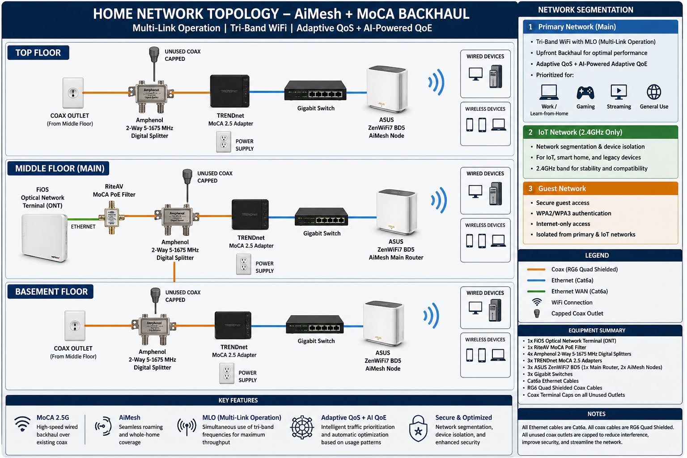

⚡ Real-world enterprise-style home network deployment using AiMesh + MoCA backhaul across a multi-floor environment.

# Home Network Lab (AiMesh + MoCA Backhaul)

## Overview
High-performance home network designed using Asus ZenWiFi 7 AiMesh with MoCA 2.5 wired backhaul over coax infrastructure.

This project focuses on maximizing throughput, reducing latency, and implementing secure, segmented networking across a three-floor environment.

---

## Network Topology

---

## Key Features
- MoCA 2.5 wired backhaul over coax
- Multi-node AiMesh deployment (3 floors)
- Tri-band WiFi with Multi-Link Operation (MLO)
- Adaptive QoS + AI-powered QoE optimization
- Segmented Primary, IoT, and Guest networks
- Hardened router configuration and security

---

## Repository Contents

- [`home-network-topology.png`](home-network-topology.png) → Visual network diagram
- [`network-details.md`](network-details.md) → Full technical breakdown of architecture, hardware, and configuration

---

## Summary

This project demonstrates hands-on experience in network design, troubleshooting, infrastructure optimization, and secure system configuration in a real-world environment.

---

## Future Improvements
- Multi-gig switch upgrade
- Expanded network monitoring
- Additional segmentation (VLANs)
- VPN integration using Asus VPN Server and/or VPN Fusion
